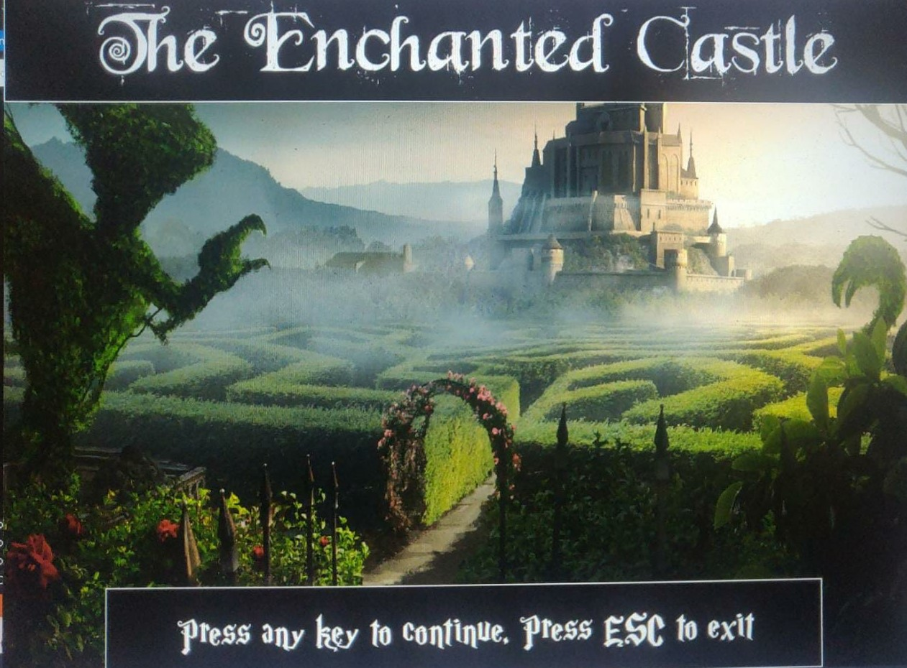
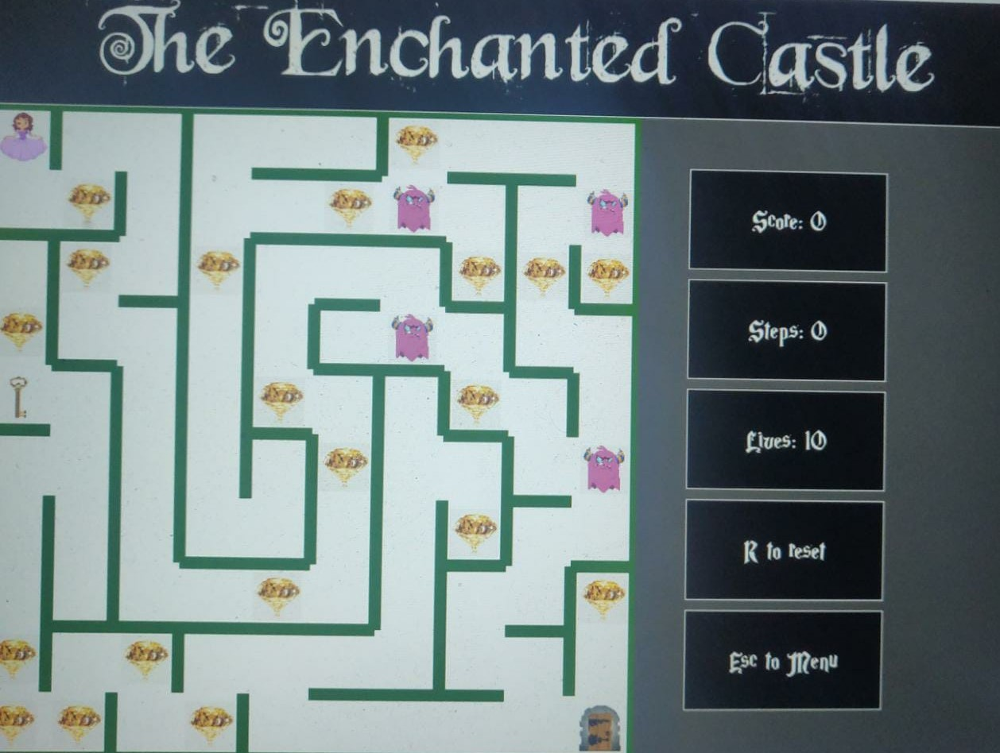
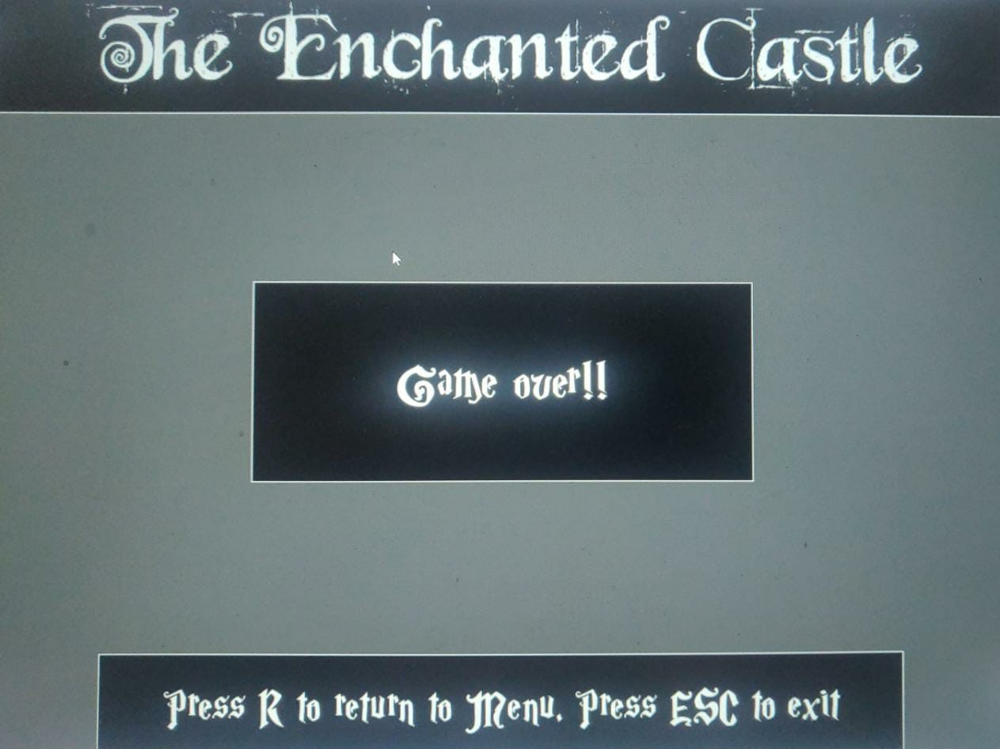

# 2-player-mazegame
### A C++ game project created using Visual Studio
---------------------------------------------------------------
In this 2D game, a player navigates through a maze filled with obstacles, rewards, a key and a door. 

Contents
--------
- [Intro](#intro)
- [Overview](#overview)
- [Installation](#installation)
- [Features](#features)
- [Classes](#classes)
	- [main](#main)
 	- [Cell](#cell)
 	- [Maze](#maze)
	- [MazeObject](#mazeobject)
		- [MazeKey](#mazekey)
		- [MazeDoor](#mazedoor)
		- [MazeDiamond](#mazediamond)
		- [MazeGuard](#mazeguard)
		- [Player](#player)
- [SDL2 Libraries](#sdl2-libraries)

### Intro
-----
This is a simple maze solving puzzle game in which a player starts at top left of the maze, has to cross some obstacles, collect some diamonds and a key and reach the door located at right bottom corner of the maze to win. The player gets 10 lives to begin with and can use reset button which resets them to initial position. 
This is the homescreen of the game.

The game follows a fairytale storyline in which the player is a princess who has to cross a maze to reach her castle. The princess collects some dimaonds on the way, escapes some monsters and finds a key to the door. This plot is explained in about screen of the game. 

After that there is a menu in which the user can play a single player game, or a 2 player offline game in which players take turns to make moves in the maze. The user can exit as well. Here, mouse click is to be used for selecting the desired option. 

A single player game screen looks like follows. The game staticstics are displayed on the right part of the screen. The objects are rendered everytime a keyboard button is pressed. The princess moves by using up, down, left, right buttons. R can be used to reset the princess to top left at the cost of one life. ESC button can be used to reach to menu screen

If the user wins, i.e. reaches the bottom left of the maze within the use of 10 lives, then the win screen appears.

If the user loses, i.e. loses all the lives before reaching the bottom left of the maze then this game over screen appears. 

