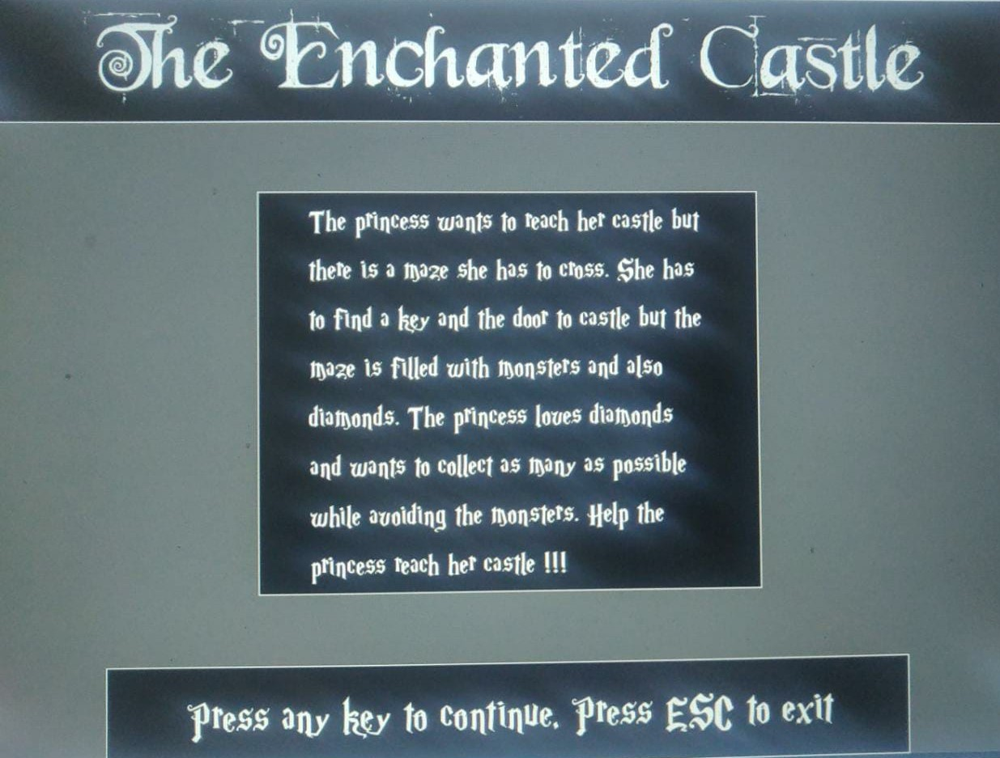
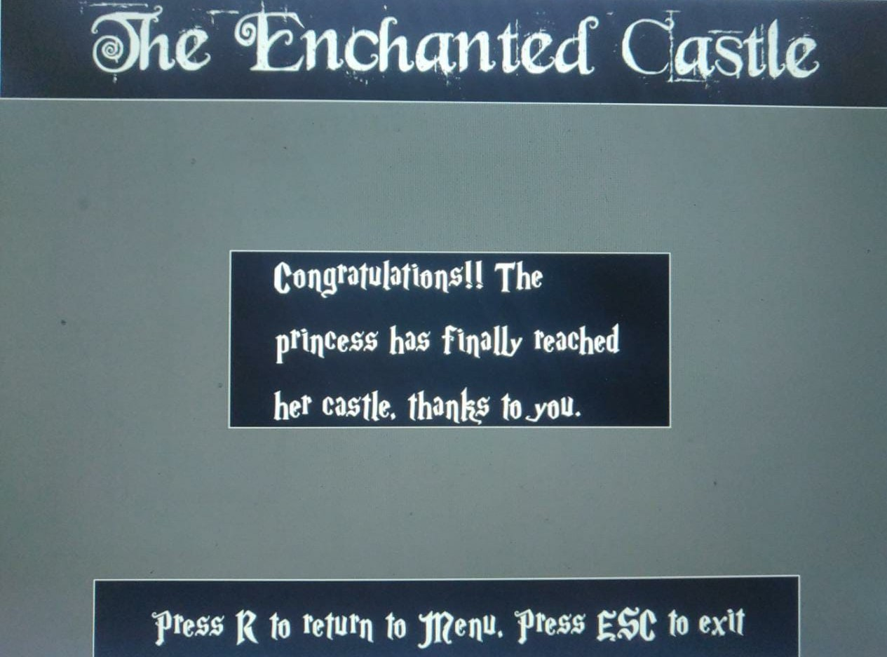

# 2-player-mazegame
### A C++ game project created using Visual Studio
---------------------------------------------------------------
In this 2D game, a player navigates through a maze filled with obstacles, rewards, a key and a door. 

Contents
--------
- [Intro](#intro)
- [Overview](#overview)
- [Installation](#installation)
- [Classes](#classes)
	- [main](#main)
 	- [Cell](#cell)
 	- [Maze](#maze)
	- [MazeObject](#mazeobject)
		- [MazeKey](#mazekey)
		- [MazeDoor](#mazedoor)
		- [MazeDiamond](#mazediamond)
		- [MazeGuard](#mazeguard)
		- [Player](#player)
- [References](#references)

### Intro
-----
This is a simple maze solving puzzle game in which a player starts at top left of the maze, has to cross some obstacles, collect some diamonds and a key and reach the door located at right bottom corner of the maze to win. The player gets 10 lives to begin with and can use reset button which resets them to initial position. 
This is the homescreen of the game.

The game follows a fairytale storyline in which the player is a princess who has to cross a maze to reach her castle. The princess collects some dimaonds on the way, escapes some monsters and finds a key to the door. This plot is explained in about screen of the game. 

After that there is a menu in which the user can play a single player game, or a 2 player offline game in which players take turns to make moves in the maze. The user can exit as well. Here, mouse click is to be used for selecting the desired option. 

A single player game screen looks like follows. The game staticstics are displayed on the right part of the screen. The objects are rendered everytime a keyboard button is pressed. The princess moves by using up, down, left, right buttons. R can be used to reset the princess to top left at the cost of one life. ESC button can be used to reach to menu screen

A double player screen looks like follows. Each player takes turns to make the move with player 1 starting first. 

If the user wins, i.e. reaches the bottom left of the maze within the use of 10 lives, then the win screen appears.

If the user loses, i.e. loses all the lives before reaching the bottom left of the maze then this game over screen appears. 

### Overview
Created using 
- **Microsoft Visual C++**
- **Microsoft Visual Studio 2019**
- **SDL2 2.0.14**
- **SDL2 Image 2.0.5**
- **SDL2 TTF 2.0.15**
- **SDL2 Mixer 2.0.4**
- **Boost**

### Installation
#### For Windows
1. Download the project. 
2. Download boost files from [link](https://www.boost.org/users/download/) and add to deps folder inside code folder.  
3. Open the Solution in Microsoft Visual Studio (double click the **.sln file** inside the code folder)
4. Change the Build Configuration to x86
5. Use the Local Windows Debugger to Build and Run the game

### Classes
#### main
The main.cpp initialises the game and contains the gameplay loops. This class handles creating the window and renderer, rendering the objects and displaying information. This class handles the current game state according to which contents are shown on the screen. If the game state is 'single' or 'double', maze(s) and player(s) are created and the gameloop is executed. 
#### cell
Cell.h contains the cell class which makes up the maze. Each Room has information about its position (row, col in the maze), direction of walls, room rectangle and others. 
#### maze
The maze.cpp contains the logic for creating and initialising  maze and maze objects. The maze can be thought of as matrix of cells which are interconnnected to each other. It is created using bfs and backtracking algorithm. It has functions for rendering the maze and a virtual function 'NextCycle' to change the guard positions regularly. 
#### MazeObject
The MazeObject is the parent class for all maze objects including the player, diamonds, key, door and guards. It has functions for rendering the object image and keeping track of the current room the object is in. 
##### Mazekey
This class contains the key the player needs to collect.
##### MazeDoor
This class contains the door the player needs to reach to win. This is located at bottom right of the maze.
##### MazeDiamond
This class contains the diamonds the player can collect on the way to increase score. Each diamond adds 100 to the score. These are spread randomly across maze. 
##### MazeGuard
This class contains the monsters that can take life of the player if the player and monster are in one cell at any point of time. These guards are capable of moving by a few cells. 
##### Player 
This class contains the player of the game and functions to move the player, reset it to start. 
### References
1. https://lazyfoo.net/tutorials/SDL/index.php
2. https://github.com/maciejspychala/sdl-game
3. https://github.com/alinp25/MazeGenerator

